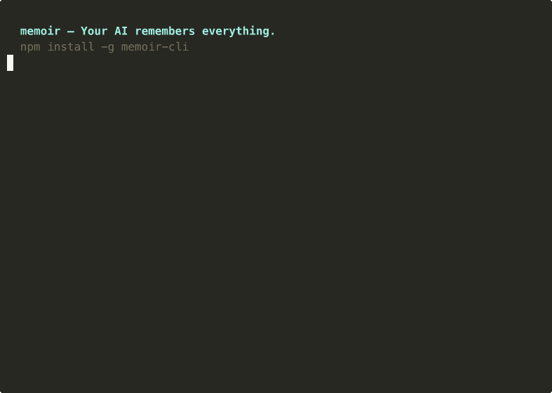

<div align="center">

# memoir

**Sync your AI memory across every device and every tool.**

[](https://npmjs.org/package/memoir-cli)
[](https://npmjs.org/package/memoir-cli)
[](https://opensource.org/licenses/MIT)
[](https://nodejs.org)

Your AI tools forget you on every new machine. memoir fixes that.

[Website](https://memoir.sh) &bull; [npm](https://npmjs.org/package/memoir-cli) &bull; [Blog](https://memoir.sh/blog)

<br />



</div>

## Why memoir

You spend weeks teaching your AI tools how you code. Your CLAUDE.md is dialed in. Your .cursorrules are perfect. Your ChatGPT custom instructions know your stack.

Then you get a new laptop. **Everything is gone.**

memoir backs up, restores, and **translates** your AI memory across any machine and any tool. One command to save. One command to restore.

```bash
npm install -g memoir-cli
```

## Supported Tools (11)

| Tool | What gets synced |
|------|-----------------|
| **ChatGPT** | CHATGPT.md custom instructions |
| **Claude Code** | ~/.claude/ settings, memory, CLAUDE.md files |
| **Gemini CLI** | ~/.gemini/ config, GEMINI.md files |
| **OpenAI Codex** | ~/.codex/ config, AGENTS.md, codex.md |
| **Cursor** | Settings, keybindings, .cursorrules |
| **GitHub Copilot** | Config, copilot-instructions.md |
| **Windsurf** | Settings, keybindings, .windsurfrules |
| **Zed** | Settings, keymap, tasks |
| **Cline** | Settings, .clinerules |
| **Continue.dev** | Config, .continuerules |
| **Aider** | .aider.conf.yml, system prompt |

Plus **per-project configs** — memoir scans your filesystem for CLAUDE.md, GEMINI.md, CHATGPT.md, .cursorrules, and AGENTS.md across all your projects.

## Quick Start

```bash
# Install
npm install -g memoir-cli

# First-time setup (GitHub repo or local)
memoir init

# Back up all your AI configs
memoir push

# Restore on a new machine
memoir restore
```

That's it. Every AI tool gets its memory back.

## Key Features

### Translate between AI tools
```bash
memoir migrate --from chatgpt --to claude
# AI-powered — rewrites conventions, not copy-paste
```

Works between any combination: ChatGPT, Claude, Gemini, Cursor, Copilot, Codex, Windsurf, Aider, and more. Translate to one tool or all at once:

```bash
memoir migrate --from chatgpt --to all
```

### Session handoff
```bash
# Laptop dying? Capture your session
memoir snapshot

# Pick up on another machine
memoir resume --inject --to claude
```

### Profiles (personal / work)
```bash
memoir profile create work
memoir push --profile work
memoir profile switch personal
```

Each profile has its own repo and tool filters. Work configs never mix with personal.

### Cloud sync (Pro)
```bash
memoir login
memoir cloud push      # encrypted cloud backup
memoir cloud restore   # restore from any version
memoir history         # view all backup versions
```

Free tier: 3 cloud backups. Pro ($5/mo): unlimited + version history.

### Security
```bash
memoir doctor
# Scans for secrets, API keys, .env files before pushing
```

memoir **never** syncs credentials, API keys, .env files, or auth tokens.

## All Commands

| Command | What it does |
|---------|-------------|
| `memoir init` | Setup wizard — GitHub or local storage |
| `memoir push` | Back up all AI configs |
| `memoir restore` | Restore on a new machine |
| `memoir status` | Show detected AI tools |
| `memoir doctor` | Diagnose issues, scan for secrets |
| `memoir view` | Preview what's in your backup |
| `memoir diff` | Show changes since last backup |
| `memoir migrate` | Translate memory between tools via AI |
| `memoir snapshot` | Capture current coding session |
| `memoir resume` | Pick up where you left off |
| `memoir profile` | Manage profiles (personal/work) |
| `memoir cloud push` | Back up to memoir cloud |
| `memoir cloud restore` | Restore from memoir cloud |
| `memoir history` | View cloud backup versions |
| `memoir login` | Sign in to memoir cloud |
| `memoir update` | Self-update to latest version |

## How memoir compares

| Feature | memoir | skillshare | ai-rulez | memories.sh |
|---------|--------|-----------|----------|-------------|
| Cross-device sync | **Yes** | Yes (git) | No | Yes |
| AI-powered translation | **Yes** | No | No | No |
| Tools supported | **11** | 40+ | 18 | 3 |
| Cloud backup | **Yes** | No | No | Yes ($15/mo) |
| Version history | **Yes** | No | No | No |
| Session handoff | **Yes** | No | No | No |
| Profiles | **Yes** | No | No | No |
| Secret scanning | **Yes** | Yes | No | No |
| Free & open source | **Yes** | Yes | Yes | No |

memoir is free and open source. Cloud sync starts at $0 (3 backups free).

## Common Workflows

### New laptop setup
```bash
# Old machine
memoir push

# New machine
npm install -g memoir-cli
memoir init      # connect to same repo
memoir restore   # all configs restored in seconds
```

### Switching from ChatGPT to Claude
```bash
memoir migrate --from chatgpt --to claude
# Your custom instructions become a proper CLAUDE.md
```

### Daily sync between machines
```bash
memoir push      # end of day on laptop
memoir restore   # next morning on desktop
```

### Cross-platform (Mac ↔ Windows ↔ Linux)
```bash
# Push from Mac
memoir push

# Restore on Windows — paths remap automatically
memoir restore
```

## Requirements

- Node.js >= 18
- Works on macOS, Windows, Linux

## Contributing

Contributions welcome — especially new tool adapters and migration improvements.

1. Fork the repo
2. Create your branch (`git checkout -b feature/my-feature`)
3. Commit and push
4. Open a PR

## Links

- **Website:** [memoir.sh](https://memoir.sh)
- **npm:** [memoir-cli](https://npmjs.org/package/memoir-cli)
- **Blog:** [memoir.sh/blog](https://memoir.sh/blog)
- **Issues:** [GitHub Issues](https://github.com/camgitt/memoir/issues)

## License

MIT
