<div align="center">

# memoir

**Persistent memory for AI coding tools.**

[](https://npmjs.org/package/memoir-cli)
[](https://npmjs.org/package/memoir-cli)
[](https://opensource.org/licenses/MIT)
[](https://nodejs.org)

Your AI forgets everything between sessions. memoir gives it long-term memory via MCP.

Works with Claude Code, Cursor, Windsurf, Gemini, and 7 more tools.

[Website](https://memoir.sh) &bull; [npm](https://npmjs.org/package/memoir-cli) &bull; [Blog](https://memoir.sh/blog)

<br />



</div>

## The Problem

You told Claude your project uses Zustand, not Redux. You explained your auth middleware to Cursor. You spent weeks building up context across your AI tools.

Next session? **Gone.** New machine? **Gone.** Switch tools? **Gone.**

## How memoir fixes it

memoir is a **persistent memory layer** that runs via [MCP](https://modelcontextprotocol.io) inside your AI tools. Your AI can search, read, and save memories automatically — across sessions, tools, and machines.

```
you: how does auth work in this project?

  memoir_recall("auth setup architecture")
  Found 3 memories matching "auth"

claude: Based on your previous sessions: this project uses JWT auth
  with refresh tokens, the middleware is in src/middleware/auth.ts,
  and you chose Zustand over Redux for auth state (decided March 12).
```

No re-explaining. memoir remembered.

## Quick Start

```bash
# Install
npm install -g memoir-cli

# Setup
memoir init
```

### Add MCP to your AI tools

**Claude Code** — add to `~/.mcp.json`:
```json
{
  "mcpServers": {
    "memoir": { "command": "memoir-mcp" }
  }
}
```

**Cursor** — add to `.cursor/mcp.json`:
```json
{
  "mcpServers": {
    "memoir": { "command": "memoir-mcp" }
  }
}
```

That's it. Your AI tools now have 6 memory abilities:

| MCP Tool | What it does |
|----------|-------------|
| `memoir_recall` | Search across all your AI memories |
| `memoir_remember` | Save context for future sessions |
| `memoir_list` | Browse all memory files by tool |
| `memoir_read` | Read a specific memory in full |
| `memoir_status` | See which AI tools are detected |
| `memoir_profiles` | Switch between work/personal |

## What Gets Synced

memoir syncs three layers that no other tool connects:

### Layer 1: AI Memory (via MCP + CLI)
Configs, instructions, and project knowledge across 11 tools — searchable and writable from inside any AI conversation.

| Tool | What gets synced |
|------|-----------------|
| **Claude Code** | ~/.claude/ settings, memory, CLAUDE.md files |
| **Gemini CLI** | ~/.gemini/ config, GEMINI.md files |
| **ChatGPT** | CHATGPT.md custom instructions |
| **OpenAI Codex** | ~/.codex/ config, AGENTS.md |
| **Cursor** | Settings, keybindings, .cursorrules |
| **GitHub Copilot** | Config, copilot-instructions.md |
| **Windsurf** | Settings, keybindings, .windsurfrules |
| **Zed** | Settings, keymap, tasks |
| **Cline** | Settings, .clinerules |
| **Continue.dev** | Config, .continuerules |
| **Aider** | .aider.conf.yml, system prompt |

### Layer 2: Session State
What you were **doing** — not just what your AI knows, but the active context.

- Last coding session captured automatically
- What files you changed, what errors you hit, what decisions you made
- Injected into your AI on restore so it picks up mid-conversation
- Secrets auto-redacted (API keys, tokens, passwords stripped before sync)

### Layer 3: Workspace
Your actual projects — code, files, everything.

- **Git projects:** Remote URLs saved, auto-cloned on restore
- **Non-git projects:** Bundled as compressed archives, unpacked on restore
- **Uncommitted work:** Saved as patches, applied after clone
- **Zero git commands needed** — memoir handles it all

## Key Features

### Cross-tool memory
Tell Claude something once. Cursor knows it too. memoir is the shared memory layer between all your AI tools.

### Translate between AI tools
```bash
memoir migrate --from chatgpt --to claude
# AI-powered — rewrites conventions, not copy-paste

memoir migrate --from chatgpt --to all
# Translate to every tool at once
```

### Cross-machine sync
```bash
# On your main machine
memoir push

# On any other machine
memoir restore -y
# ✔ AI memory restored (Claude, Gemini, Cursor, 11 tools)
# ✔ 44 projects cloned & unpacked
# ✔ Uncommitted changes applied
# ✔ Session context injected — AI picks up mid-conversation
```

### E2E Encryption
```bash
memoir encrypt    # toggle encryption on/off
memoir push       # prompted for passphrase, AES-256-GCM encrypted
```

Your backup is encrypted before it leaves your machine. Secret scanning auto-redacts API keys, tokens, and passwords.

### Profiles (personal / work)
```bash
memoir profile create work
memoir push --profile work
memoir profile switch personal
```

### Cloud sync
```bash
memoir login
memoir cloud push      # encrypted cloud backup
memoir cloud restore   # restore from any version
```

### Cross-platform (Mac / Windows / Linux)
Paths remap automatically between platforms. Push from Mac, restore on Windows. It just works.

## All Commands

| Command | What it does |
|---------|-------------|
| `memoir init` | Setup wizard — GitHub or local storage |
| `memoir push` | Back up AI memory + workspace + session |
| `memoir restore` | Restore everything on a new machine |
| `memoir mcp` | Start MCP server for editor integration |
| `memoir status` | Show detected AI tools |
| `memoir doctor` | Diagnose issues, scan for secrets |
| `memoir view` | Preview what's in your backup |
| `memoir diff` | Show changes since last backup |
| `memoir migrate` | Translate memory between tools via AI |
| `memoir snapshot` | Capture current coding session |
| `memoir resume` | Pick up where you left off |
| `memoir encrypt` | Toggle E2E encryption |
| `memoir profile` | Manage profiles (personal/work) |
| `memoir cloud push` | Back up to memoir cloud |
| `memoir cloud restore` | Restore from memoir cloud |
| `memoir history` | View cloud backup versions |
| `memoir login` | Sign in to memoir cloud |
| `memoir share` | Create encrypted shareable link |
| `memoir upgrade` | View plans and upgrade |
| `memoir update` | Self-update to latest version |

## How memoir compares

| Feature | memoir | dotfiles managers | ai-rulez | memories.sh |
|---------|--------|-------------------|----------|-------------|
| MCP memory layer | **6 tools** | No | No | No |
| AI memory sync | **11 tools** | No | 18 tools | 3 tools |
| Cross-tool recall | **Yes** | No | No | No |
| Workspace sync | **Yes** | No | No | No |
| Session handoff | **Yes** | No | No | No |
| AI-powered migration | **Yes** | No | No | No |
| E2E encryption | **Yes** | No | No | No |
| Secret scanning | **Yes** | Some | No | No |
| Cross-platform remap | **Yes** | Some | No | No |
| Cloud backup | **Yes** | No | No | Yes ($15/mo) |
| Profiles | **Yes** | No | No | No |
| Free & open source | **Yes** | Yes | Yes | No |

## Common Workflows

### Your AI remembers across sessions
```
# Monday — you explain your auth setup to Claude
# ...Claude calls memoir_remember to save the decision

# Thursday — new conversation
you: "add a protected route"
# Claude calls memoir_recall, finds your auth architecture
# No re-explaining needed
```

### New machine setup
```bash
npm install -g memoir-cli && memoir init && memoir restore -y
# Done. Everything's back.
```

### Switching AI tools
```bash
memoir migrate --from chatgpt --to claude
# Your custom instructions become a proper CLAUDE.md
```

### Team onboarding
```bash
# Senior dev pushes team config
memoir push --profile team

# New hire runs one command
memoir restore --profile team
# Every project cloned. Every AI tool configured. Day one productive.
```

## Security

- **E2E encryption** — AES-256-GCM with scrypt key derivation
- **Secret scanning** — 20+ patterns detect API keys, tokens, passwords, connection strings
- **Auto-redaction** — secrets stripped from session handoffs before sync
- **No credentials synced** — .env files, auth tokens, and API keys are never included
- **Passphrase verified** — wrong passphrase caught before decrypt attempt
- **Local MCP server** — runs on your machine, no data sent to external services

## Requirements

- Node.js >= 18
- Git (for workspace sync)
- Works on macOS, Windows, Linux

## Contributing

Contributions welcome — especially new tool adapters and MCP improvements.

1. Fork the repo
2. Create your branch (`git checkout -b feature/my-feature`)
3. Commit and push
4. Open a PR

## Links

- **Website:** [memoir.sh](https://memoir.sh)
- **npm:** [memoir-cli](https://npmjs.org/package/memoir-cli)
- **Blog:** [memoir.sh/blog](https://memoir.sh/blog)
- **Issues:** [GitHub Issues](https://github.com/camgitt/memoir/issues)

## License

MIT
